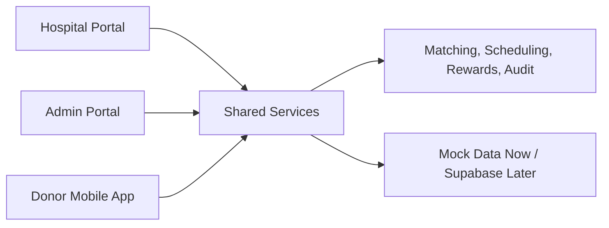

# How The Platform Works

Doe Sangue Angola is one connected platform with three views: Admin, Hospital, and Donor Mobile.

The important idea is simple: all three views use the same shared services and data model. When one side changes something, the other sides can show the change.

## Simple Map



## The Blood Request Flow

1. A hospital creates an urgent blood request.
2. The shared request service stores the request.
3. The matching agent finds compatible donors.
4. The notification service creates donor alerts.
5. The donor sees the request in the mobile app.
6. The donor accepts or rejects the request.
7. The scheduling agent creates a 4-digit PIN.
8. The hospital sees the incoming donor and PIN status.
9. The hospital validates the PIN.
10. The request is marked completed.
11. The reward agent updates donor points.
12. The audit agent records the full history.

## What Each Agent Does

Agents are small pieces of business logic.

| Agent | Simple Meaning |
| --- | --- |
| `matchingAgent` | Finds donors who can give the needed blood type. |
| `schedulingAgent` | Creates appointment details and PIN codes. |
| `eligibilityAgent` | Checks if a donor may be eligible to donate. |
| `rewardAgent` | Adds points, badges, and progress after donation. |
| `fraudAgent` | Scores suspicious activity for review. |
| `auditAgent` | Records important actions for accountability. |

## Why Mock Data Exists

Mock data lets the team demo and test the full product before connecting a real backend.

Mock mode is useful for:

- Investor demos.
- Founder walkthroughs.
- Design review.
- Training hospital staff.
- Testing the user journey safely.

Mock mode should not be used for real patient or donor operations.

## Supabase Later

Supabase is the planned backend. It will eventually store:

- Users.
- Donors.
- Hospitals.
- Blood requests.
- Appointments.
- Notifications.
- Rewards.
- Audit logs.
- Fraud reviews.

The project already includes schema files and provider placeholders so the team can migrate step by step.

## Data Modes

The platform is designed to switch data sources.

| Mode | What It Does |
| --- | --- |
| `mock` | Uses local demo data. This is the default. |
| `supabase` | Uses Supabase database services. Prepared for later. |

The current safe default is:

```bash
NEXT_PUBLIC_DATA_MODE=mock
EXPO_PUBLIC_DATA_MODE=mock
```

Only switch to Supabase after authentication, database security, and pilot data have been reviewed.

## Permissions

Each role should only see what it needs.

| Role | Can See |
| --- | --- |
| Admin | National dashboards, all requests, hospitals, donors, fraud, audit logs. |
| Hospital | Its own requests, donors arriving, inventory, appointments, reports. |
| Donor | Their profile, nearby requests, notifications, rewards, settings. |

The security docs explain this in more detail.

## Realtime Updates

The current realtime system is mock-based. It simulates live updates such as:

- Hospital creates request, Admin ticker updates.
- Donor accepts, Hospital incoming donor list updates.
- PIN is validated, Admin status updates.

Later, Supabase Realtime can replace the mock event bus.

## Founder Summary

Think of the system as one shared operating center:

- Hospitals create demand.
- Donors provide supply.
- Admin monitors safety and national coordination.
- Shared services keep the three experiences synchronized.
